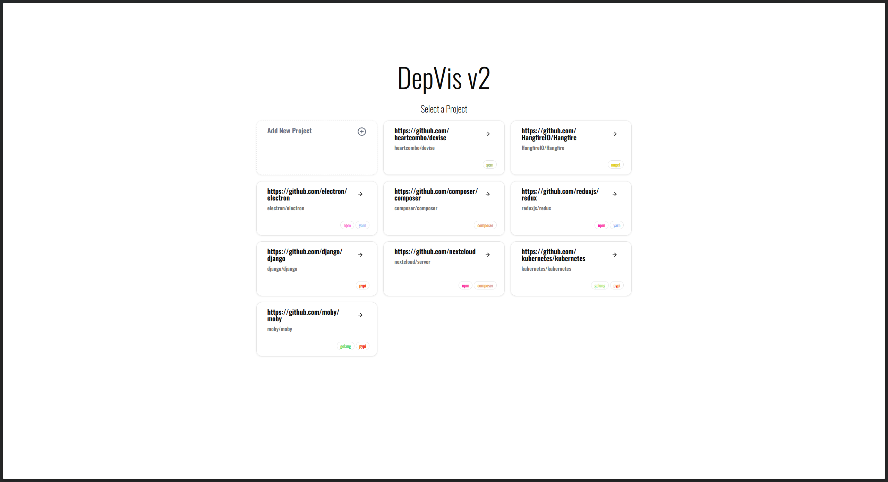
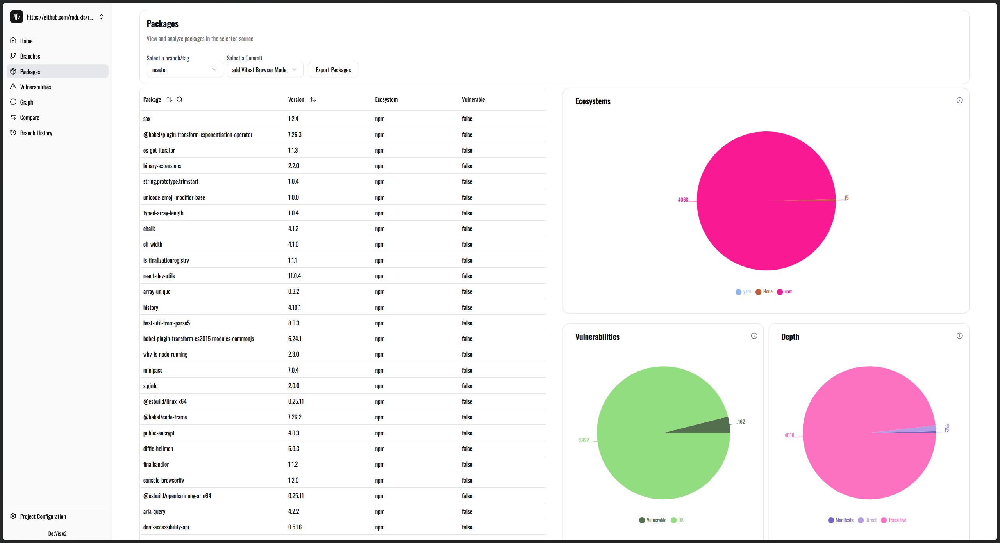
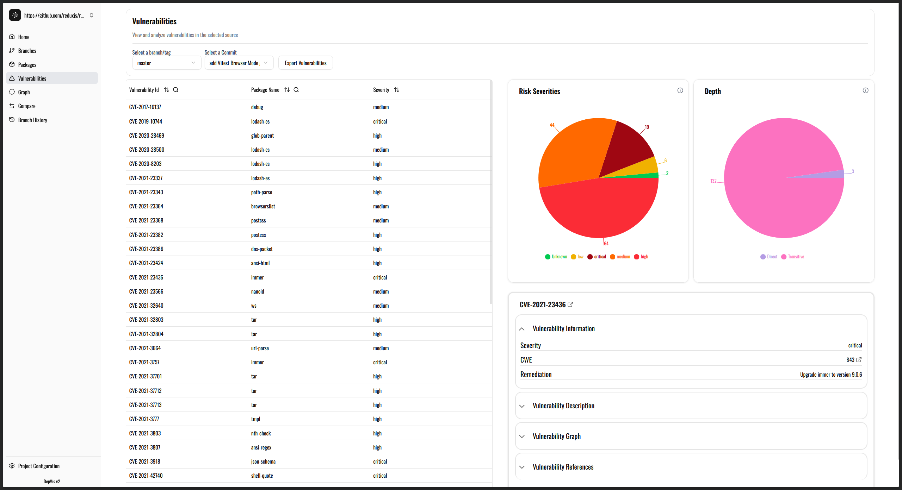
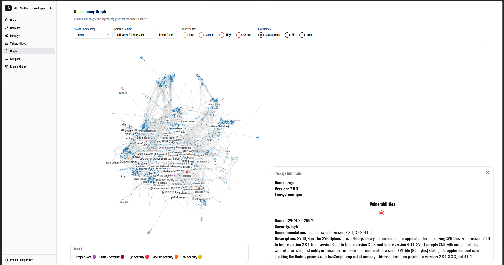

# DepVis v2

## Quick Start

```bash
git clone https://github.com/Jofo0/DepVis2.git
cd depvis-v2
cp .env.example .env
docker compose up
```

Then open [this](http://localhost:8080/) url.

## Description

DepVis v2 is a tool for visualizing and analyzing open-source dependencies and vulnerabilities using a Git repository URL as input.

It leverages Trivy to scan repositories, supporting a wide range of ecosystems (see supported languages: https://trivy.dev/docs/latest/guide/coverage/language/#supported-languages).

This tool was developed as part of the Master's thesis  
**"DepVis v2: A Graph-Based Visualization Tool for Software Dependencies"**  
by Jozef Gajdoš at FI MUNI.

## Screenshots

<div style="display: flex; flex-direction: column; align-items: center; gap: 20px;">
  
  
  
  
</div>

## Features

- Graph-based visualization of dependencies
- Detailed list of dependencies
- Vulnerability detection with detailed insights
- Full branch history scanning
- Comparison of branches and tags

## Running The App

### Pre-requisites 
1. Docker Installed Locally
2. Fill out the .env file. There is an example .env file that you can use as a template. 

### Build the application

1. To build this app you need to run `docker compose up` in this folder.
2. You can then access the application at [this](http://localhost:8080/) url.

### Updating the app

1. To update the application run `sh update-app.sh`
2. This will pull the latest code from the repository, build the docker image and restart the application.

## Usage

1. To use the application, create a new project, enter the link to the Git repository you want to analyze in the input field, select all branches or tags you want analyzed.
2. After you create the project, the application will start analyzing the repository. This may take some time depending on the size of the repository and the number of dependencies.
3. Once the analysis is complete, you can view the results in multiple pages containing graph visualization of the dependencies, list of dependencies, list of vulnerabilities and more.

